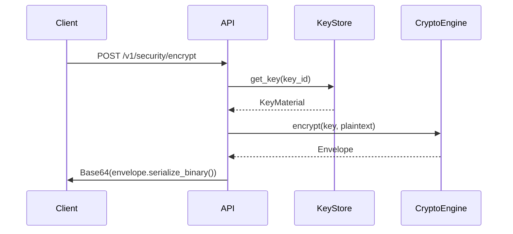
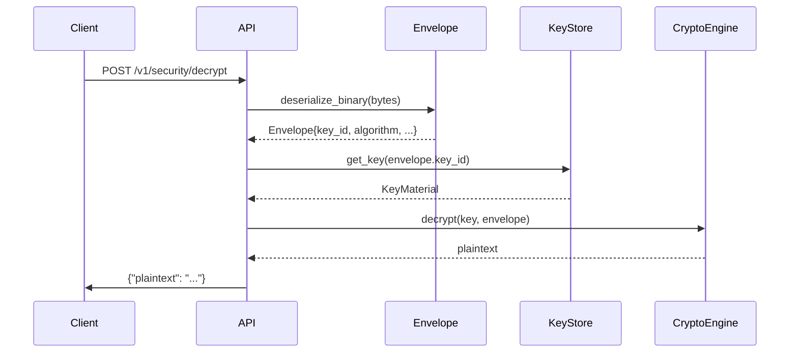

## Overview

The QIMEM Platform is organized into three primary layers:

- **Library (`qimem`)**: Core cryptographic engine, envelope serialization, key storage abstractions
- **Binaries**: HTTP API servers (`qimem-api`, `qauth-api`) and CLI tools (`qimem`, `qauth`)
- **APIs**: RESTful endpoints for security operations (`/v1/security/*`), authentication (`/v1/auth/*`), and plugin management (`/v1/plugins/*`)

<Note>
  The platform exposes versioned APIs starting with `/v1/` to ensure backward compatibility as features evolve.
</Note>

## Library Components

The core `qimem` library (src/lib.rs:1-21) provides:

### Cryptography Module

```rust
pub use crypto::{Algorithm, CryptoEngine};
```

- **Algorithm**: Enum supporting AES-256-GCM (always available) and ChaCha20-Poly1305 (optional `chacha` feature)
- **CryptoEngine**: Handles encryption/decryption operations with AEAD guarantees

### Envelope Format

```rust
pub use envelope::Envelope;
```

Deterministic binary and JSON serialization for encrypted payloads with tamper detection.

### Key Storage

```rust
pub use keystore::{InMemoryKeyStore, KeyMaterial, KeyMetadata, KeyStore};
#[cfg(feature = "stateful")]
pub use keystore::PostgresKeyStore;
```

- **KeyStore trait**: Abstract interface for key lifecycle operations
- **InMemoryKeyStore**: Fast, ephemeral storage for development
- **PostgresKeyStore**: Durable, transactional storage for production (requires `stateful` feature)

## Binaries

### qimem-api

HTTP server exposing key lifecycle and encryption endpoints:

```bash
cargo run --bin qimem-api
```

**Endpoints**:
- `POST /keys` - Create new encryption key
- `POST /encrypt` - Encrypt plaintext with key_id
- `POST /decrypt` - Decrypt envelope
- `POST /rotate` - Rotate key to new version

### qauth-api

Unified platform server combining security, authentication, and plugin APIs:

```bash
cargo run --bin qauth-api
```

**Endpoints**:
- `/v1/security/*` - Encryption operations
- `/v1/auth/*` - QAuth identity and token management
- `/v1/plugins/*` - Plugin manifest registration

### CLI Tools

Command-line interfaces for key generation, encryption/decryption, and realm/user management.

## Request Flow

### Encryption Flow

1. **Client** sends `POST /v1/security/encrypt` with `key_id` and plaintext `input`
2. **API Handler** (src/platform_api.rs:123-135) extracts key from store
3. **CryptoEngine** generates random nonce, encrypts with AES-256-GCM
4. **Envelope** serialization produces deterministic binary format
5. **Response** returns Base64-encoded envelope



### Decryption Flow

1. **Client** sends `POST /v1/security/decrypt` with Base64 envelope
2. **API Handler** (src/platform_api.rs:147-161) deserializes envelope
3. **KeyStore** retrieves key using `key_id` from envelope
4. **CryptoEngine** validates algorithm match, decrypts with tag verification
5. **Response** returns plaintext



### Key Rotation Flow

1. **Client** sends `POST /v1/security/rotate` with `key_id`
2. **KeyStore** marks old key as `active: false`
3. **KeyStore** generates new key with incremented `version` and same `lineage_id`
4. **Response** returns new `KeyMetadata`

<Info>
  Old keys remain available for decryption. Only the latest active key can encrypt new data.
</Info>

## Storage Backends

### In-Memory Store

**Source**: src/keystore/memory.rs:1-89

```rust
pub struct InMemoryKeyStore {
    keys: RwLock<HashMap<Uuid, StoredKey>>,
    lineages: RwLock<HashMap<Uuid, Uuid>>,
}
```

**Characteristics**:
- Uses `std::sync::RwLock` for thread safety
- Data lost on process restart
- No persistence or replication
- Ideal for testing and ephemeral workloads

### PostgreSQL Store (stateful feature)

**Source**: src/keystore/postgres.rs:1-99

```rust
pub struct PostgresKeyStore {
    pool: PgPool,
}
```

**Characteristics**:
- Requires `stateful` feature flag:
  ```toml
  qimem = { version = "0.1", features = ["stateful"] }
  ```
- Uses `sqlx` with connection pooling
- Atomic key rotation via transactions (src/keystore/postgres.rs:68-98)
- Supports encrypted disks and managed Postgres
- Migration system via `sqlx::migrate!`

**Schema** (migrations):
```sql
CREATE TABLE keys (
    key_id UUID PRIMARY KEY,
    lineage_id UUID NOT NULL,
    version INT NOT NULL,
    active BOOLEAN NOT NULL,
    material BYTEA NOT NULL
);
```

<Warning>
  When using PostgresKeyStore, ensure your database connection string includes SSL parameters for production deployments.
</Warning>

## Security Boundaries

### No Unsafe Code

```rust
#![deny(unsafe_code)]
```

All cryptographic operations use safe Rust wrappers (`aes-gcm`, `chacha20poly1305`).

### Key Material Protection

Key bytes are wrapped with `zeroize::Zeroizing` (src/keystore/mod.rs:37):

```rust
pub struct KeyMaterial {
    pub key_id: Uuid,
    pub material: Zeroizing<Vec<u8>>,
    pub active: bool,
}
```

Memory is securely cleared when keys are dropped.

### No Logging of Secrets

Key material is never logged or exposed in error messages.

## Next Steps

<CardGroup cols={2}>
  <Card title="Encryption" href="/concepts/encryption" icon="lock">
    Learn about AES-256-GCM and ChaCha20-Poly1305 support
  </Card>
  <Card title="Envelope Format" href="/concepts/envelope-format" icon="envelope">
    Understand deterministic serialization and tamper detection
  </Card>
  <Card title="Key Rotation" href="/concepts/key-rotation" icon="rotate">
    Explore version tracking and backward compatibility
  </Card>
  <Card title="QAuth Identity" href="/concepts/qauth-identity" icon="user-shield">
    Discover realm-based authentication and RBAC
  </Card>
</CardGroup>